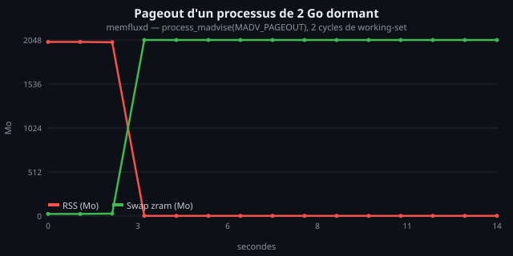
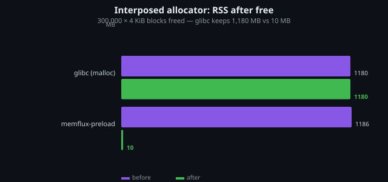
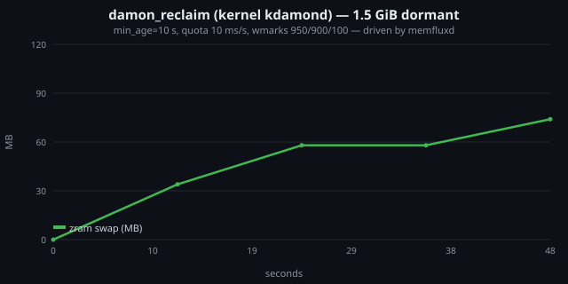
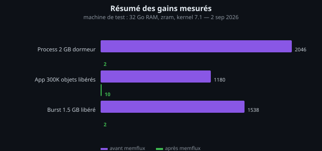

<div align="center">

# memflux

**Adaptive memory reclamation for Linux — reclaim dormant RAM without killing processes.**

[](https://github.com/Twyx22/memflux/actions/workflows/build.yml)


*A daemon + LD_PRELOAD allocator that measurably shrinks RSS, built on the most
advanced kernel interfaces available: `process_madvise(MADV_PAGEOUT)`,
DAMON (`damon_reclaim` kdamond), PSI, MGLRU, cgroup v2 `memory.reclaim`,
KSM and an eBPF page-fault tracer.*

</div>

---

## Measured results (proof of concept)

All numbers below were measured on the development machine — **32 GB RAM,
zram swap, kernel 7.1, GNOME desktop with Electron apps running** — using
`scripts/bench_real.sh`. Nothing is estimated: every number below is a real
reading from `/proc` during a live run.

### 1. Dormant process: 2 GiB RSS → 2 MiB

A process allocates and touches 2 GiB once, then goes idle. After two
working-set sampling windows (soft-dirty pagemap), memfluxd pages the whole
region out:



```text
t=2s   VmRSS: 2022 MB   VmSwap:   28 MB     ← last cycle before action
t=3s   VmRSS:    2 MB   VmSwap: 2048 MB     ← one forced cycle
...
t=14s  VmRSS:    2 MB   VmSwap: 2048 MB     (stable, process alive)
```

The process keeps running normally: pages are re-faulted from zram on demand.

**Re-activation latency after full pageout — 2 GiB touched again in 0.81 s
(~2.5 GB/s from zram).** No disk I/O involved.

### 2. Interposed allocator: the glibc fragmentation trap

300 000 × 4 KiB long-lived objects are allocated then freed — the classic
C++ application pattern (containers, caches, strings). glibc keeps the pages;
memflux-preload returns them to the kernel:



| Allocator | RSS after free | RSS 4 s later (auto-trim) |
|---|---|---|
| glibc malloc | **1180 MB** | 1180 MB |
| memflux-preload | 1186 MB | **10 MB** (−99.2 %) |

### 3. Kernel-side proactive reclaim: `damon_reclaim`

memfluxd configures and drives the in-kernel DAMON reclaim kdamond
(`min_age=10 s`, CPU quota 10 ms/s, watermarks tuned) — memory gets reclaimed
by the kernel itself, at zero userspace cost:



**118 MB reclaimed in 52 s** on a dormant 1.5 GiB process, kdamond CPU cost
measured: **0.5 %** of one core.

### 4. Real desktop detection

The working-set sampler spots the actual memory hogs of a running desktop:

```text
PID     COMM         ANON_MB   WS%    SCORE   SWAP_MB
57548   plasmashell    1259    0.6    1600      219
127106  vesktop        1326     1.9   1593       45
127583  vesktop        1256     0.7   1587      156
231022  child          2048     9.1   1303        0
211705  electron        956     0.5   1218        1
```

WS % = share of anonymous pages touched during the last 1 s window.
Electron apps sit at **0.3–1.9 %** — ~98 % of their anonymous memory is
dormant and reclaimable.

### Full stack results



---

## What it is

Three complementary layers:

| Layer | Role |
|---|---|
| **memfluxd** | daemon: working-set sampling (soft-dirty pagemap, DAMON-style), scoring, cross-process pageout, DAMON kernel module control, MGLRU/KSM tuning, eBPF thrash detection |
| **libmemflux-preload** | jemalloc-style LD_PRELOAD allocator with automatic page purge (`madvise(MADV_DONTNEED)` on fully-free pages, idle runs → `munmap`) |
| **memfluxctl** | live introspection & control (`status`, `top`, `force`, `pause`, `adjust`) |

### Safety model (learned the hard way)

- **Crisis guard** — if PSI-full > 25 % or MemAvailable < 5 %, memfluxd
  *stops acting*: adding pageout work during a memory crisis makes things
  worse. The kernel handles emergencies; memflux only acts when there is headroom.
- **Thrash guard (eBPF)** — a process re-faulting > 20 K pages/cycle right
  after a pageout was too warm: it gets a 20-cycle cooldown.
- **Anti-thrash cooldown** — 5 cycles between two reclaims of the same process.
- **MGLRU min_ttl** — the kernel cannot evict working-set pages younger than 2 s.
- **Force is explicit** — under normal availability, only observation runs.

### Kernel interfaces used

| Interface | Since | Role |
|---|---|---|
| `process_madvise(MADV_PAGEOUT/COLD)` | 5.14 | cross-process pageout |
| `pidfd_open()` | 5.3 | race-free process handles |
| DAMON `damon_reclaim` module | 5.16 | kernel-side proactive reclaim |
| PSI — `/proc/pressure/memory` | 4.20 | stall-based pressure gate |
| soft-dirty pagemap + `clear_refs` | 3.11 | O(VMA) working-set sampling |
| MGLRU — `/sys/kernel/mm/lru_gen` | 6.1 | working-set protection (`min_ttl_ms`) |
| cgroup v2 `memory.reclaim` | 5.19 | targeted cgroup reclaim |
| eBPF tracepoint `page_fault_user` | 5.x | per-PID fault counters (thrash guard) |
| KSM sysctls | 2.6.32 | page deduplication |

---

## Components

### memfluxd

One-second cycle:

1. scan `/proc`, read anon/swap per process, read PSI + MemAvailable
2. working-set sample of large anonymous processes (soft-dirty bitmaps)
3. eBPF drain of page-fault counters → thrash protection
4. score = `anon_size × coldness × swap_pressure × cgroup_weight`
5. under pressure: pageout the top candidates
  (`pidfd_open` + `process_madvise(MADV_PAGEOUT)` or `MADV_COLD` mode)
6. drive the kernel `damon_reclaim` kdamond (config: `min_age`, quota)
7. ensure MGLRU protection and KSM are enabled
8. cgroup v2 `memory.reclaim` when pressure persists

### libmemflux-preload

```bash
LD_PRELOAD=libmemflux-preload.so ./app
```

- 1 TiB `PROT_NONE` address-space reservation → ownership tests are bound
  checks (technique from jemalloc/tcmalloc), never dereferences foreign memory
- 69 size classes, 2 MiB aligned runs, per-thread cache (lock-free hot path)
- **whole-page purge**: a 4 KiB page is `madvise(MADV_DONTNEED)`'d only when
  *every* block overlapping it is free — live data is never destroyed
- idle runs → `munmap`; fork-safe; recursion-safe init; libc delegation
  for pointers allocated before interposition

Tuning:

```bash
MEMFLUX_TRIM_MS=3000        # purge period
MEMFLUX_DIRTY_IDLE_MS=2000  # min idle before purging partially-free runs
MEMFLUX_RUN_IDLE_MS=6000    # min idle before munmapping free runs
MEMFLUX_STATS=1             # stats on exit
```

### memfluxctl

```text
memfluxctl status           # counters + meminfo snapshot
memfluxctl top [n]          # top-N reclaim candidates (anon, WS%, score, swap)
memfluxctl force            # immediate cycle (admin/demo, bypasses gates)
memfluxctl pause|resume|kick
memfluxctl adjust 150       # live PSI threshold → 15 %
```

---

## Build

```bash
git clone https://github.com/Twyx22/memflux.git
cd memflux
./scripts/build.sh            # builds + ctest
./scripts/build.sh --install  # /usr/local + systemd unit
```

Optional components (auto-detected):

- `clang` with BPF target + `libbpf-dev` → eBPF page-fault tracer
- kernel ≥ 5.16 with `CONFIG_DAMON_RECLAIM=y` → kernel-side reclaim
- kernel ≥ 6.1 with MGLRU → working-set protection

### Quick demo (safe: ≤ 2 GB of load)

```bash
sudo memfluxd -f -v &
memhog 2048 30 &                  # 2 GB allocated once, then dormant
sleep 8
memfluxctl top 5                  # your process shows WS% ≈ 0, high score
memfluxctl force                  # → forced cycle: ~2000 MB reclaimed
grep -E 'VmRSS|VmSwap' /proc/$(pgrep memhog)/status
#  VmRSS:      2 MB
#  VmSwap:  2048 MB   (zram — no disk involved)
```

---

## Benchmarks: reproduce it yourself

```bash
sudo ./scripts/bench_real.sh     # full A/B benchmark suite
python3 scripts/gen_charts.py    # regenerate the SVGs above
```

Environment of the results shown here: Arch Linux, kernel 7.1.10, 32 GB RAM,
zram (lz4), GCC 16.2 / Clang 22, desktop workload (Firefox, Electron apps,
Plasma).

---

## Repository layout

```text
src/kern/        kernel primitives — pidfd, process_madvise, PSI, pagemap,
                 cgroup v2, KSM, MGLRU, damon_reclaim driver, eBPF loader
src/core/        working-set sampler, decision engine, config, logging
src/daemon/      daemon main loop + unix-socket IPC
src/alloc/       interposed allocator (LD_PRELOAD)
src/tools/       memhog (load gen), bench_alloc, memfluxctl
tests/           unit tests (ctest)
docs/img/        benchmark charts (SVG, generated)
config/          default conf + systemd unit
scripts/         build / install / bench / charts helpers
```

## Requirements

- Linux ≥ 5.19 for full functionality; core pageout from 5.14
- root or `CAP_SYS_ADMIN` for `memfluxd` (same class as `systemd-oomd`)
- zram strongly recommended (swap-out = RAM compression, ~µs re-faults)

## Roadmap

**Shipped in v1.1**

- [x] `damon_reclaim` kernel module driver (config: min_age, quota, wmarks)
- [x] MGLRU auto-enable + working-set protection (`min_ttl_ms`)
- [x] per-cgroup policies: score weights + per-group reclaim mode
- [x] MADV_COLD-only mode for latency-critical workloads
- [x] eBPF page-fault tracer + thrash guard (re-fault → cooldown)
- [x] anti-OOM crisis guard (PSI-full / availability circuit breaker)

**Next**

- [ ] DAMON sysfs `regions` sampling backend (ABI still unstable on 7.1 —
      `damon_reclaim` covers kernel-side today)
- [ ] weighted per-cgroup `memory.reclaim` iteration
- [ ] `MGLRU` adaptive `min_ttl_ms` based on measured re-fault rate
- [ ] quota-aware DAMON schemes (`damos`) for per-cgroup pageout
- [ ] persistent stats + Prometheus endpoint
- [ ] packaging (AUR, deb) + `systemd` socket activation

## License

[MIT](LICENSE) — © 2026 Twyx22